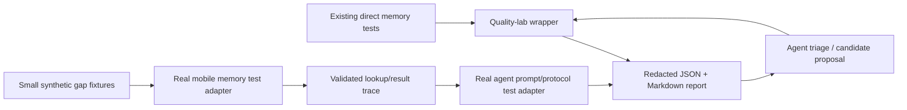

# Memory Quality Lab: Focused Extension Plan

**Status:** Implementation-ready plan
**Scope:** Improve the completed deterministic Hindi/Hinglish memory evaluation
with structured fixtures, machine-readable reports, and agent-assisted failure
triage.
**Primary command:** `scripts/run-memory-eval.sh`

## 1. Decision

Companion AI already has a deterministic, phone-owned memory regression gate:

```bash
scripts/run-memory-eval.sh
```

It exercises real mobile memory and realtime-agent tests for exact recall,
aliases/graph expansion, abstention, supersession, decay, sensitive-memory
exclusion, receipts, timeouts, prompt budgets, and deterministic strategy
isolation. Phase 5 automated Hindi/Hinglish evaluation and redacted metrics are
therefore complete. Real Android validation remains a separate Phase 5 task.

This work does **not** build a second evaluation platform or replace the
existing gate. It adds a small internal workflow around the completed gate so a
memory defect can be found, reproduced, classified, fixed, and kept fixed.

The outcome is a lightweight **Memory Quality Lab** within this repository:

```text
run existing deterministic tests
  -> run a small set of structured gap fixtures
  -> emit a redacted machine-readable report
  -> agent classifies any failure and proposes a minimal regression/fix
  -> rerun baseline and candidate
  -> human reviews the proposed product change
```

## 2. Goals

The Lab must make it easy to answer these questions without launching the
voice UI, joining a real LiveKit room, or touching real user data:

1. Did the real mobile memory code store, reject, replace, or expire the right
   record?
2. Did the real deterministic retrieval path return the correct memory IDs and
   omit forbidden IDs?
3. Did the realtime agent put only those returned packets into the LLM context,
   with the latest user transcript still authoritative?
4. Did a failure occur in admission, consolidation, routing, retrieval, prompt
   assembly, protocol handling, fallback, or safety/privacy exclusion?
5. Does a proposed fix solve the target defect without regressing existing
   protected tests?

## 3. Non-negotiable boundaries

- Use the existing production Dart/Python memory domain code. Do not create a
  second implementation of admission, retrieval, graph expansion, ranking, or
  prompt assembly.
- Use synthetic text only. Do not read app databases, user transcripts,
  device IDs, production logs, production rooms, or production credentials.
- Every run uses a temporary/in-memory test database and test vector index.
- The deterministic `hi-IN` core suite must use deterministic retrieval and
  reranking. It must assert that it made zero embedding/reranker HTTP calls.
- Deterministic assertions, not an LLM score, decide pass/fail.
- Crisis/safety queries bypass normal memory lookup. Sensitive memory must never
  be injected into normal companion context.
- The Lab may propose tests and code changes, but never automatically merges,
  deploys, enables a model, changes a prompt, or changes a safety setting.
- Normal production logs remain redacted. Test reports must not contain full
  turn, memory, packet, or prompt text, even when fixtures are synthetic.

## 4. What stays as-is

The following assets remain the baseline and are not duplicated:

| Existing asset | Role after this plan |
| --- | --- |
| `scripts/run-memory-eval.sh` | Required deterministic regression command. |
| `docs/evals/hindi_hinglish_memory_eval.md` | Current scenario/pass criteria and real-phone validation protocol. |
| Mobile memory tests | Direct validation of Drift admission, consolidation, retrieval, and fallback behaviour. |
| Realtime-agent tests | Direct validation of routing, reliable request correlation, stale/timeout handling, and prompt injection. |
| `docs/architecture/long_term_memory.md` | Source of truth for memory architecture and Phase 5 status. |
| `docs/architecture/safety_privacy.md` | Source of truth for safety/privacy behaviour. |

There is no Dart-to-Python HTTP/gRPC bridge in this plan. The mobile tests and
agent tests already cover their real domain code. When a cross-boundary check is
needed, the fixture runner records the exact mobile lookup response contract and
the agent test consumes that contract as a validated fixture. Existing agent
tests continue to cover request sequence and stale/timeout behaviour.

## 5. Proposed repository layout

```text
companion-ai/
├── scripts/
│   ├── run-memory-eval.sh               # Existing required gate
│   └── run-memory-quality-lab.sh         # New wrapper: gate + fixtures + report
│
├── evaluation/memory/
│   ├── fixtures/                         # Small synthetic JSONL/YAML scenarios
│   ├── schemas/                          # Scenario and report schemas
│   └── reports/                          # Gitignored local/CI artifacts only
│
├── apps/mobile/test/                     # Existing tests; targeted fixture adapter
├── services/realtime-agent/tests/         # Existing tests; targeted packet/prompt adapter
│
└── docs/evals/
    └── memory_quality_lab.md             # Runbook and report interpretation
```

`evaluation/memory/reports/` must be gitignored. Committed fixtures contain
only synthetic text. Reports reference fixture IDs, test IDs, hashes, counts,
routes, and memory IDs, never expanded text.

## 6. Minimal execution flow



For one structured scenario, the Lab does the following:

1. Creates a fresh temporary mobile-memory database and fixed test clock.
2. Replays final synthetic user/assistant turns through the same public
   admission, replacement, receipt, summary, and retrieval code used by app
   tests.
3. Asserts expected durable memory IDs and metadata states.
4. Performs a query through real deterministic `MemoryLookupService` logic.
5. Records selected packet IDs, route, count, fallback state, and timing.
6. Supplies the validated packet contract to the existing realtime-agent test
   path and asserts the resulting prompt context.
7. Produces pass/fail output and a redacted report entry.

This is sufficient to validate the memory-product boundary. It deliberately
does not simulate UI, microphone capture, STT streaming, TTS, LiveKit network
transport, or a real LLM response.

## 7. Fixture dataset

### 7.1 Start small

The current direct tests already form most of the deterministic dataset. Add
only **15–20 structured gap fixtures** initially. Do not create a 60–100 case
benchmark before there is evidence that it is needed.

The first fixtures should cover gaps that are difficult to see in the current
summary table or that exercise cross-boundary contracts:

| Group | Required initial example |
| --- | --- |
| Same-session recall | Explicit safe fact retrieved later in the same session. |
| Previous-session recall | Confirmed safe fact retrieved in a later session. |
| Mixed-script correction | Corrected Hindi/Hinglish preference supersedes its older form. |
| Receipt bookkeeping | `last_used_at` does not consume a pending receipt prompt; stale response does not mark it prompted. |
| Invalid assistant turn | Empty/repeated/invalid assistant final text cannot create spurious memory or summary. |
| Assistant role integrity | Assistant content never appears as a user prompt message. |
| Safety with existing records | A crisis query bypasses normal lookup even when ordinary or sensitive records already exist. |
| Packet protocol | Stale/wrong request sequence cannot inject a packet into the prompt. |
| Noisy final transcript | A low-quality/replaced/re-speak transcript cannot become retrievable durable memory. |
| Context cap | Six-packet and character/message limits hold with many eligible records. |

Each confirmed production or test defect must add one minimal regression fixture
before its fix is accepted. That is how the dataset grows: by evidence, not by
bulk synthetic generation.

### 7.2 Fixture contract

Fixtures must be stable, human-readable, and schema-validated. Every scenario
has a fixed ID, tags, fixed clock offsets, final-text conversation turns, and
explicit expected identifiers.

```yaml
schema_version: 1
id: correction_preference_mixed_script_v1
protected: true
tags: [semantic, correction, mixed_script]
sessions:
  - session_key: s1
    turns:
      - turn_key: u1
        role: user
        transcript_status: final
        stt_confidence: 0.98
        offset_ms: 0
        text: "Mujhe advice se pehle bas sunna pasand hai."
      - turn_key: a1
        role: assistant
        status: final
        offset_ms: 1000
        text: "Theek hai, pehle main sunungi."
      - turn_key: u2
        role: user
        transcript_status: final
        stt_confidence: 0.98
        offset_ms: 2000
        text: "अब advice bhi de sakte ho."
storage_expect:
  must_exist: [comfort_style_advice_allowed]
  must_be_superseded: [comfort_style_listen_only]
query:
  text: "Mujhe difficult din ke baad kaise support karoge?"
  expect:
    route: semantic
    must_include_memory_ids: [comfort_style_advice_allowed]
    must_not_include_memory_ids: [comfort_style_listen_only]
    max_packets: 6
    latest_user_authoritative: true
```

Contract rules:

- `protected: true` means failure is P0/P1, not an aggregate-quality warning.
- Canonical `must_include_memory_ids` is an exact requirement: all required IDs
  must appear. There is no partial pass for a protected canonical case.
- `must_not_include_memory_ids` covers stale, superseded, sensitive, rejected,
  expired, unrelated, and old-correction records.
- Schema changes require a version bump, migration note, compatibility test,
  and validation of every existing fixture.
- Fixture text must be native or professionally fluent Hindi/Hinglish reviewed
  before promotion to `protected` status.

### 7.3 Fixture governance

- An agent may draft a fixture, but it is `proposed` until a maintainer accepts
  its deterministic expectations.
- The product owner assigns at least one native or professionally fluent
  Hindi/Hinglish reviewer for language-sensitive fixtures.
- Begin with a review pilot of 10 fixtures. Record review effort and ambiguity
  findings, then decide whether to expand to 15–20.
- A fixture review checks: natural language, asserted memory semantics,
  intended route, safety classification, expected IDs, and whether it overlaps
  an existing direct test.
- The reviewer validates the expected behaviour, not a preferred assistant
  wording. This remains a memory-layer suite.

## 8. Assertions and failure categories

The Lab adds deterministic assertions only. Required assertions are:

- Correct record creation/rejection/replacement/expiry.
- Correct kind, sensitivity, receipt state, temporal state, and source role.
- Correct deterministic route and no lookup for greeting/safety paths.
- Required final packet IDs present; forbidden IDs absent; no duplicate packets.
- Packet count at most six and context budgets respected.
- Latest user message remains authoritative; assistant text remains assistant
  role content.
- A stale/invalid/wrong-sequence response cannot reach prompt construction.
- Timeout, model unavailability, or invalid packet continues without memory and
  does not block a normal turn.
- Sensitive/rejected/expired/superseded memory never enters normal context.

Every failure is classified once, with optional secondary categories:

| Code | Meaning |
| --- | --- |
| `ADMISSION` | Wrong durable record was created, rejected, or replaced. |
| `CONSOLIDATION` | Receipt, decay, summary, graph, or supersession state is wrong. |
| `ROUTING` | Incorrect memory-needed route or lookup bypass. |
| `RETRIEVAL` | Wrong, missing, duplicate, or forbidden packet selection. |
| `PROTOCOL` | Stale/invalid packet or sequence-correlation problem. |
| `PROMPT` | Wrong role, budget, grouping, or latest-user priority. |
| `FALLBACK` | Timeout/model/vector/reranker failure does not fail safely. |
| `SAFETY_PRIVACY` | Sensitive content or safety ordering rule is violated. |

Do not add per-candidate ranking telemetry initially. Existing tests, selected
packet IDs, route, and failure category should diagnose the first defects. Add a
test-only optional lookup observer only if an actual failure cannot distinguish
admission/filtering/ranking causes. It must be disabled in release builds and
must not emit text into production logs.

## 9. Reports

`scripts/run-memory-quality-lab.sh` must first run the existing required gate,
then run the structured fixture adapter, and write both JSON and Markdown under
the gitignored reports directory.

Minimum report fields:

```text
run ID
git revision and dirty/clean status
fixture schema/version/hash
test command and suite durations
pass/fail totals
fixture/test ID
failure category and severity
expected versus actual memory IDs/counts/route (never content)
fallback state and timing when applicable
suggested relevant code area
```

Severity:

- **P0:** safety/privacy leakage, normal memory lookup on a crisis route,
  cross-turn packet injection, role corruption, or an attempt to use
  production data/endpoints.
- **P1:** protected fixture failure, wrong correction/supersession behaviour,
  greeting over-retrieval, packet-budget break, or failed safe fallback.
- **P2:** non-protected regression fixture failure or missing coverage item.
- **P3:** a maintainability or quality observation with no deterministic fault.

If any P0/P1 check fails, the report says `not ready`; aggregate scores cannot
override it.

### 9.1 Safe execution and artifacts

- Provide a `--dry-run` mode that lists the test command, fixture paths,
  temporary paths, and endpoints it would use without executing anything.
- The runner fails closed if an API/LiveKit URL, database path, environment
  variable, or credential matches a known production target.
- CI reports are restricted to repository maintainers and have a documented
  short retention period. No report text is committed.
- Full synthetic trace/prompt text, if ever required for local debugging, is an
  explicit opt-in local artifact and is deleted with the temporary run output.

## 10. Agent-assisted self-improvement workflow

The agent is an analyst and patch proposer, not an authority that changes the
product.

On a failed run it may:

1. Read the redacted report, minimal fixture, and relevant product source.
2. Identify the most likely failure category and code area.
3. Propose a minimal new direct test or structured regression fixture.
4. Propose a narrowly scoped patch in an isolated worktree.
5. Run the required existing gate plus the target fixture on baseline and
   candidate.
6. Write a candidate report: target fixed/not fixed, all protected checks,
   regressions, risks, and rollback.

It may not:

- Change/merge/deploy code automatically.
- Change persona prompts, provider/model flags, retrieval thresholds, safety
  phrases, crisis rules, dependency rules, or VAD/endpointing configuration.
- Use a real user dataset or send app/user content to any model.
- Claim a fix works without a green baseline/candidate comparison.

A candidate is an improvement only when:

1. The target fixture passes.
2. `scripts/run-memory-eval.sh` passes.
3. All protected structured fixtures pass.
4. No P0/P1 regression appears.
5. A human approves the code/config change.

## 11. Rollout

### Stage A — Structured fixtures and reporting

**Goal:** Make the existing deterministic gate easier to inspect and extend.

Tasks:

1. Add fixture/report schemas and validators.
2. Add `run-memory-quality-lab.sh`, including dry-run and production-target
   rejection.
3. Add temporary database/clock fixture adapter using real mobile memory code.
4. Add validated lookup-response contract fixture into existing agent prompt
   tests; do not add a network bridge.
5. Write/review the 10-fixture pilot, then expand to 15–20 only if the review
   process is clear.
6. Create JSON/Markdown redacted reports.

Exit criteria:

- Existing `scripts/run-memory-eval.sh` remains green and semantically
  unchanged.
- One scenario proves real mobile state → selected packet contract → real agent
  prompt assertion.
- All pilot fixtures are schema-valid, reproducible by ID, and reviewed.
- The report contains no transcript/memory/prompt text.

### Stage B — Regression discipline and targeted diagnostics

**Goal:** Turn every confirmed memory bug into a permanent safety-preserving
test.

Tasks:

1. Add a fixture only for a verified gap, defect, or architecture edge case.
2. Add P0/P1 protected cases for receipt bookkeeping, assistant corruption,
   safety bypass, corrections, and packet correlation.
3. Add a minimal test-only lookup trace observer only when a concrete failure
   cannot be diagnosed from final IDs/route/current tests.
4. Add baseline-versus-candidate comparison to the report.

Exit criteria:

- A deliberately seeded mobile/agent handoff defect is detected and classified.
- Its smallest reproducer fails before the fix and passes after it.
- A deliberately regressive candidate is rejected because it fails a protected
  fixture or the existing gate.

### Stage C — Agent triage and proposal workflow

**Goal:** Reduce time from failed test to evidence-backed proposed fix.

Tasks:

1. Define the agent’s report input/output format and allowed filesystem/test
   actions.
2. Generate failure classification, proposed minimal fixture, patch hypothesis,
   and baseline/candidate report.
3. Require human review for all fixture promotions and product changes.
4. Schedule the quality-lab wrapper only after it is stable locally; keep the
   fast existing gate on every memory-related change.

Exit criteria:

- A seeded defect produces a reproducible report and a bounded patch proposal.
- No proposal can be marked improved without all defined deterministic gates.
- The agent makes no automatic product change.

## 12. Explicitly deferred work

The following are not part of the first implementation because they add cost or
complexity without current evidence of memory-layer value:

- A live Dart-to-Python HTTP/gRPC bridge or a new evaluation service.
- A 60–100+ case benchmark, unrestricted synthetic mutation generator, or
  benchmark dashboards.
- LLM-as-a-judge, response-tone scoring, external judge-provider governance,
  or judge calibration.
- Recall@K/MRR/NDCG dashboards beyond exact fixture pass/fail requirements.
- Withheld-agent benchmark sets.
- Audio/STT overlay, the supplied MP3 corpus, and ASR-noise modelling.
- Automatic retrieval/configuration tuning.
- Real-device automation; follow the existing manual Android protocol instead.

Any deferred item needs a separate evidence-based proposal. Audio work also
requires licence/provenance confirmation and human-validated transcripts before
it can begin.

## 13. Remaining non-blocking decisions

- The product owner assigns the Hindi/Hinglish fixture reviewer(s) before a
  fixture is promoted to protected status.
- The team records CI artifact retention and maintainer-access policy before
  scheduled CI reporting is enabled.
- The team may choose a fast-gate performance target after measuring the Stage
  A baseline. If the wrapper is slow, it must not replace the existing fast
  deterministic gate.

These decisions do not block Stage A scaffolding or the first technical
fixtures.

## 14. Implementation order

1. Add schemas and safe runner configuration/dry-run behaviour.
2. Build the report wrapper around the existing gate.
3. Add one temporary-DB structured fixture that proves mobile result to agent
   prompt contract.
4. Add and review the 10-fixture pilot.
5. Expand to 15–20 evidence-driven fixtures and protected cases.
6. Add baseline/candidate report comparison.
7. Add agent triage/proposal workflow.
8. Reconsider deferred features only after the above produces real failure
   clusters that cannot be handled with this workflow.

## 15. References

- `docs/architecture/long_term_memory.md`
- `docs/evals/hindi_hinglish_memory_eval.md`
- `docs/architecture/observability_metrics.md`
- `docs/architecture/safety_privacy.md`
- `docs/SPRINTS.md`
- `scripts/run-memory-eval.sh`
